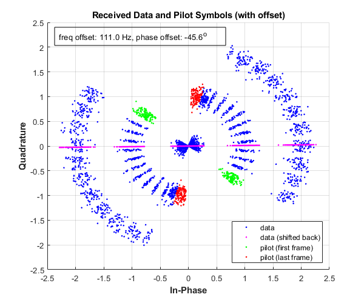

##### Simple CDMA Message decoding

- A simple CDMA decoder for a string (ASCII) message (provided filter and sampling characteristics) in MATLAB (R2019b version)
- \_src/cdma.m contains the main driving code for decoding in stages
- \_data/Rcvd_Jeong.mat contains data to be decoded (symbols after transmit filter)

##### Approach

1. Parameters for the filter, chip rate, upsampling rate, and chips per frame are defined. We use Walsh code using 8-ary Hadamard transform to encode data, and apply a Root-Raised Cosine (RRCOS) filter with a roll-off factor of 0.75 with the order of M = 25.
2. Generate the maximal-length sequence (M-, or PN-, sequence) using a linear shift feedback register (LFSR)
3. Apply receive filter with the known parameters
4. Find the frequency and phase offset from generated pilot, after finding where data frame begins by cross-correlation
5. Decode symbols into ASCII characters

##### Results

> A written report is available [here](doc/simple_cdma_report.pdf)

> A published file (MATLAB) is available [here](doc/cdma.pdf)

> Message: "Be Sure To Drink Your Ovaltine." (from the movie `A Christmas Story` (1983) [IMDB Site](https://www.imdb.com/title/tt0085334/))
> Signal Constellations for data and pilot frames

> 
