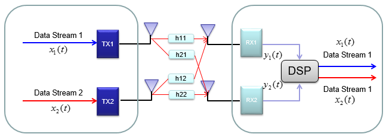
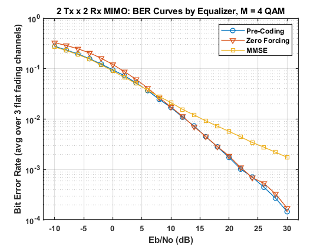
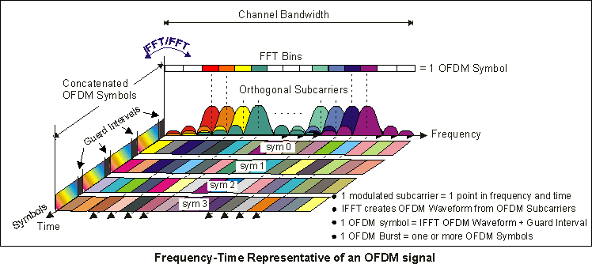
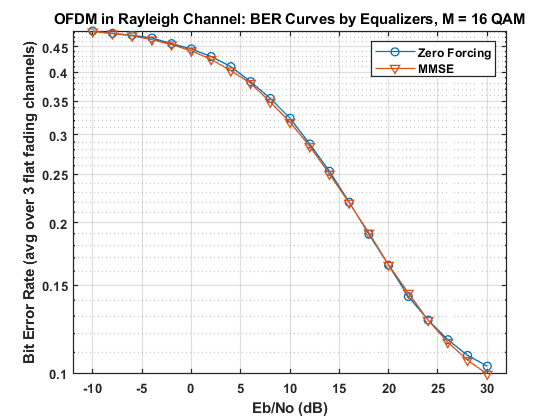

### Single-User OFDM-MIMO with Equalizers with known CSIT/CSIR

- Simulation of single-user MIMO with equalizers (precoding, zero-forcing, MMSE), OFDM with equalizers (zero-forcing, MMSE), and OFDM-MIMO with equalizers (OFDM and MIMO) assuming known CSIR
- _src/su_mimo_ofdm.m_ contains the code for mimo, ofdm, ofdm-mimo in sections
- Realistically, we would want to take into consideration 3 impairments: timing offset, frequency offset, clock drift. In this implementation, the time delay, freq offset or clock drift is not accounted for, by working in complex band for OFDM and assuming there is no delay in transmission.
- Environment: MATLAB 2019b, Communications Toolbox

#### Results

> A written report is available [here](doc/report.pdf)

> A published file (MATLAB) is available [here](doc/code_published.pdf)

#### MIMO

> [Image Source](https://www.sharetechnote.com/html/BasicProcedure_LTE_MIMO.html)

The requirements of this implementation is as follows:

- x2 transmit antennas, x2 receive antennas
- **Precoding** equalizer: known CSIT
- **Zero-forcing, MMSE** equalizers: known CSIR
- White Gaussian noise with a fixed power over channels
- 4 QAM Modulation
- Flat fading Rayleigh channel

> Bit Error Rate curve

#### OFDM

> [Image Source](http://rfmw.em.keysight.com/wireless/helpfiles/89600b/webhelp/subsystems/wlan-ofdm/Content/ofdm_basicprinciplesoverview.htm)

The requirements of this implementation is as follows:

- **Zero-forcing, MMSE** equalizers with perfect channel state information at the receiver (CSIR) assumed
- White Gaussian noise with a fixed power over channels
- 16 QAM Modulation
- Frequency selective channel
- Specifications from IEEE 802.11a [click for more information](http://rfmw.em.keysight.com/wireless/helpfiles/89600b/webhelp/subsystems/wlan-ofdm/Content/ofdm_80211-overview.htm)

> Bit Error Rate curve

#### OFDM-MIMO

The requirements of this implementation is as follows:

- **Zero-forcing, MMSE** equalizers for OFDM, **Precoding, zero-forcing, MMSE** equalizers for frequency-selective MIMO channels
- Perfect CSIR assumed
- 4 QAM
- White Gaussian noise with a fixed power over channels

> Bit Error Rate curve

#### References
[1] Agarwal, Ami, et al. “LINEAR VS NON LINEAR EQUALIZER IN DIFFERENT CHANNEL CONDITION.” International Journal of Advanced Technology &amp; Engineering Research (IJATER) 3rd International e-Conference on Emerging Trends in Technology, 2014. ICETT 2014; ISSN: 2250-3536

[2] Bassou, Abdesselam & Hasni, Abdelhafid & Lakhdar, Abdelmounaim. (2014). UTTCM-based optimization of coded communication system. American Journal of Computation, Communication and Control. 1. 50-55. 

[3] “MIMO(Multiple Input Multiple Output),” ShareTechnote. [Online]. Available: https://www.sharetechnote.com/html/BasicProcedure--
LTEMIMO.html. [Accessed: 24-Apr-2020].

[4] Andrea Goldsmith. 2005. Wireless Communications. Cambridge University Press, USA.

[5] “Concepts of Orthogonal Frequency Division Multiplexing (OFDM) and 802.11 WLAN,” Concepts of Orthogonal Frequency Division Multiplexing (OFDM) and 802.11 WLAN. [Online]. Available: http://rfmw.em.keysight.com/wireless/helpfiles/89600b/webhelp/subsystems/wlan-ofdm/Content/ofdm\_basicprinciplesoverview.htm. [Accessed: 24-Apr-2020].

[6] G. L. Stuber, J. R. Barry, S. W. McLaughlin, Ye Li, M. A. Ingram and T. G. Pratt, "Broadband OFDM-MIMO wireless communications," in Proceedings of the IEEE, vol. 92, no. 2, pp. 271-294, Feb. 2004.

[7] Bhagwatkar, Sonali \& Patil, B P \& Satpute, Bhalchandra. (2016). Performance of MMSE channel equalization for MIMO OFDM system. 1-3. 10.1109/ICCUBEA.2016.7860083.

[8] Renfors, Markku, et al. “12.3.3.” Orthogonal Waveforms and Filter Banks for Future Communication Systems, edited by Xavier Mestre, Academic Press, 2017, pp. 315–316.
