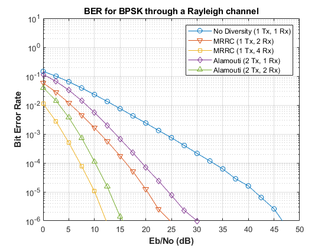

##### Diversity Schemes at Transmitter and Receiver

- Simulation of Maximal-Ratio Receiver Combining (MRRC) technique and Alamouti diversity schemes for a coherent BPSK signal through Rayleigh flat fading channel in MATLAB (R2019b version)
- _src/alamouti_sim.m_ contains main simulation code for each case plotted in the BER curve
- _src/newRayleighChan.m_ contains generation code for a Rayleigh channel, mimicking built-in *comm.RayleighChannel*or _rayleighchan_ functions

##### MRRC: receive diversity scheme

- Single transmit antenna, multiple antennas at the receiver
- Combining/selecting and switching for signal quality improvement (+)
- Effective in mitigating multipath fading
- Branch signals are weighted with a gain factor, which is proportional to its own SNR
- (-) Overheads in cost, size and power of remote units
> For maximum likelihood decision-based decoding, equation for x_{equalized} in this [website link](http://www.dsplog.com/2008/09/28/maximal-ratio-combining/) is used.

##### Alamouti: transmit diversity scheme (STBC)

- (+) No feedback from receiver to transmitter for channel conditions
- (+) Reduction in computational complexity in coding (only uses negation and conjugation)
- (+) No bandwidth expansion
- (-) Power reduction in half due to simultaneous transmission at both transmit antennas

##### Results

> A written report is available [here](doc/mrrc_alamouti_report.pdf)

> A published file (MATLAB) is available [here](doc/mrrc_alamouti_sim_code.pdf)

> Bit Error Rate curve

