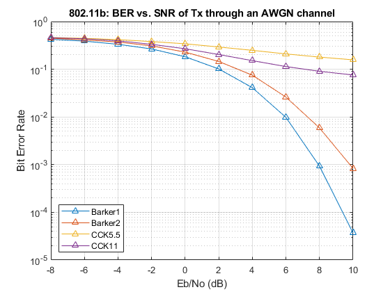
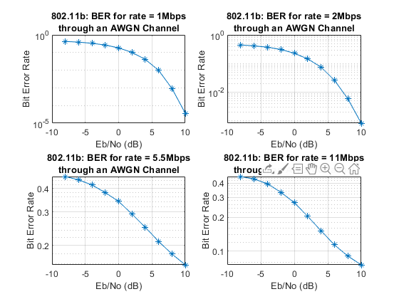

##### WLAN IEEE 802.11b

- Simulation of IEEE 802.11b (Wireless Local Area Network) in MATLAB (R2019b; Requires Comms (modulators), DSP (comm. fcns), WLAN (scrambler) Toolbox)
- For code, _wlan80211b_packetframe.m_ should contain packet frame generation (though preamble, header verification is omitted on the receiver side due to poor decoding predictions for CCK at the moment)

##### IEEE 802.11b

- Modulation schemes: DSSS (1, 2 Mbps), CCK (5.5, 11 Mbps)
- Coding sequences: Barker-11 chipping sequence (static PN sequence), CCK codeword
- Pulse Shaping Filter: Root Raised Cosine Fitler ($M$ = 40, $\beta$ = 0.3)

> ##### Glossary
>
> - DSSS: Direct Sequence Spread Spectrum
> - CCK: Complementary Code Keying

##### Class definitions

- _Filter_: Tx and Rx along with up/down-sampling
- _ModSchemes_: BarkerModulator/Demodulator, CCKModulator/Demodulator, plotBarkerAutocorrelation

> A written report is available [here](doc/ece408_802.11b_report.pdf)

> A published file (MATLAB) is available [here](doc/wlan80211b_packetframe.pdf)
